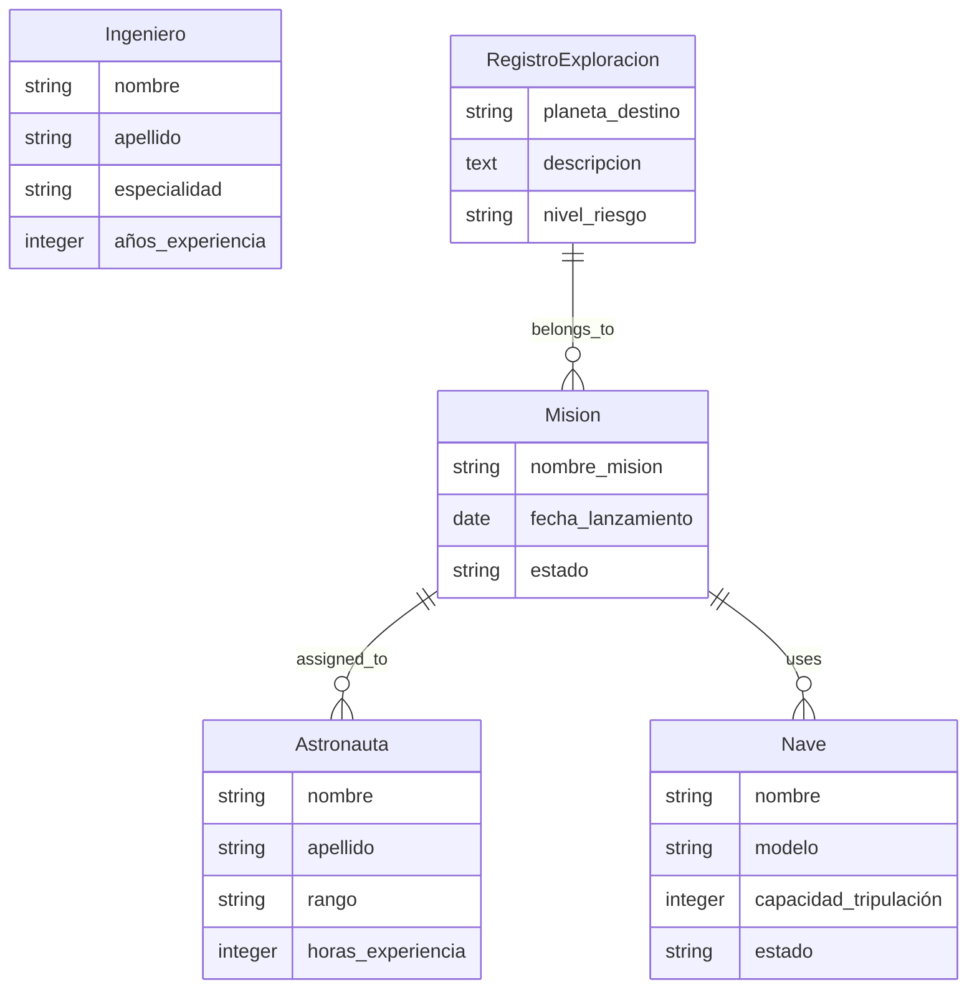
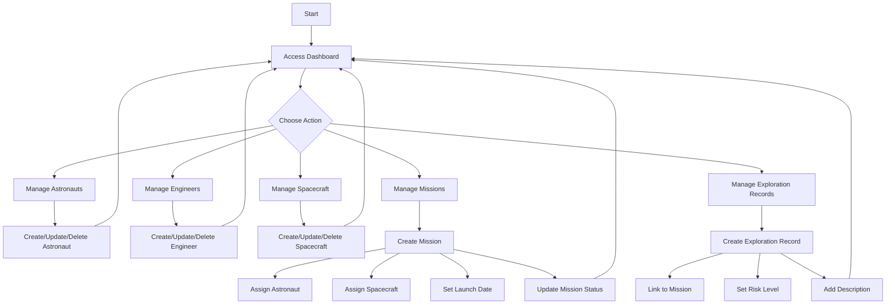

# AstroNova Mission Control

A comprehensive Django-based web application for managing space missions, astronauts, engineers, spacecraft, and exploration records. Designed with a professional dark space-themed UI using Bootstrap 5 and glass-style cards.

## Features

- **Astronaut Management**: Track astronaut details including name, rank, and experience hours.
- **Engineer Management**: Manage engineering team with specialties and years of experience.
- **Spacecraft Fleet**: Monitor spacecraft with model, capacity, and operational status.
- **Mission Control**: Schedule and track missions with launch dates, status, assigned astronauts, and spacecraft.
- **Exploration Records**: Document planetary explorations with risk levels and mission associations.
- **Dashboard**: Overview of all entities with counts and quick access.
- **Responsive Design**: Modern, professional UI with dark space theme and glass effects.
- **CRUD Operations**: Full Create, Read, Update, Delete functionality for all models.

## Technologies Used

- **Backend**: Django 4.x, Python 3.8+
- **Frontend**: Bootstrap 5.3, HTML5, CSS3
- **Database**: SQLite (default), configurable via environment variables
- **Environment Management**: Pipenv
- **Styling**: Custom CSS with backdrop filters for glass effects

## Installation

### Prerequisites

- Python 3.8 or higher
- Pipenv (install via `pip install pipenv`)

### Setup

1. **Clone the repository**:
   ```bash
   git clone https://github.com/yourusername/astronova.git
   cd astronova
   ```

2. **Install Pipenv dependencies**:
   The project uses Pipenv for dependency management. Pipfile and Pipfile.lock are included in the repository.
   ```bash
   pipenv install
   ```
   This will install all required packages as specified in Pipfile.lock.

3. **Activate the virtual environment**:
   ```bash
   pipenv shell
   ```

4. **Configure environment variables**:
   Create a `.env` file in the project root. Here's an example:
   ```env
   SECRET_KEY=django-insecure-your-secret-key-here-change-in-production
   DEBUG=True
   DATABASE_URL=sqlite:///db.sqlite3
   ALLOWED_HOSTS=localhost,127.0.0.1
   ```
   **Note**: Generate a secure SECRET_KEY for production use.

5. **Run migrations**:
   ```bash
   python manage.py migrate
   ```

6. **Create a superuser (optional)**:
   ```bash
   python manage.py createsuperuser
   ```

7. **Collect static files**:
   ```bash
   python manage.py collectstatic
   ```

## Usage

1. **Start the development server**:
   ```bash
   python manage.py runserver
   ```

2. **Access the application**:
   Open your browser and navigate to `http://127.0.0.1:8000/`

3. **Navigate the application**:
   - Use the navigation bar to access different sections
   - Dashboard provides an overview of all records
   - Create, view, edit, and delete records through the respective pages

## Project Structure

```
AstroNova/
├── manage.py
├── Pipfile
├── Pipfile.lock
├── Settings/
│   ├── __init__.py
│   ├── asgi.py
│   ├── settings.py
│   ├── urls.py
│   └── wsgi.py
├── exploracion/
│   ├── __init__.py
│   ├── admin.py
│   ├── apps.py
│   ├── models.py
│   ├── tests.py
│   ├── urls.py
│   ├── views.py
│   ├── migrations/
│   └── templates/
│       └── exploracion/
├── static/
│   └── space.gif
└── README.md
```

## Diagrams

### Entity-Relationship Diagram



### Use Case Diagram

```mermaid
graph TD
    A[Administrator] --> B[Manage Astronauts]
    A --> C[Manage Engineers]
    A --> D[Manage Spacecraft]
    A --> E[Manage Missions]
    A --> F[Manage Exploration Records]
    A --> G[View Dashboard]
    
    B --> H[Create Astronaut]
    B --> I[Read Astronaut]
    B --> J[Update Astronaut]
    B --> K[Delete Astronaut]
    
    C --> L[Create Engineer]
    C --> M[Read Engineer]
    C --> N[Update Engineer]
    C --> O[Delete Engineer]
    
    D --> P[Create Spacecraft]
    D --> Q[Read Spacecraft]
    D --> R[Update Spacecraft]
    D --> S[Delete Spacecraft]
    
    E --> T[Create Mission]
    E --> U[Read Mission]
    E --> V[Update Mission]
    E --> W[Delete Mission]
    
    F --> X[Create Exploration Record]
    F --> Y[Read Exploration Record]
    F --> Z[Update Exploration Record]
    F --> AA[Delete Exploration Record]
```



### Flowchart



## Contributing

Contributions are welcome! Please follow these steps:

1. Fork the repository
2. Create a feature branch (`git checkout -b feature/AmazingFeature`)
3. Commit your changes (`git commit -m 'Add some AmazingFeature'`)
4. Push to the branch (`git push origin feature/AmazingFeature`)
5. Open a Pull Request

## License

This project is licensed under the MIT License - see the [LICENSE](LICENSE) file for details.

## Authors

- **Your Name** - *Initial work* - [Your GitHub](https://github.com/yourusername)

## Acknowledgments

- Space background image sourced from public domain
- Bootstrap for responsive design framework
- Django community for excellent documentation and support